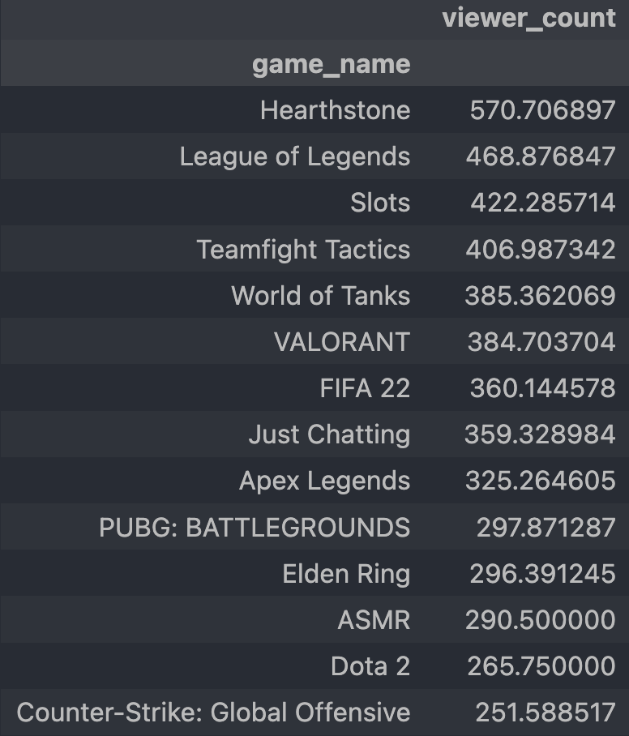
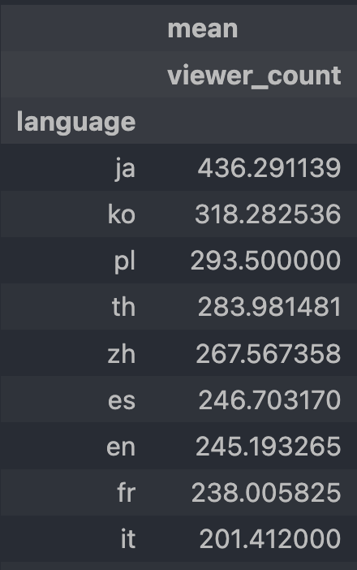
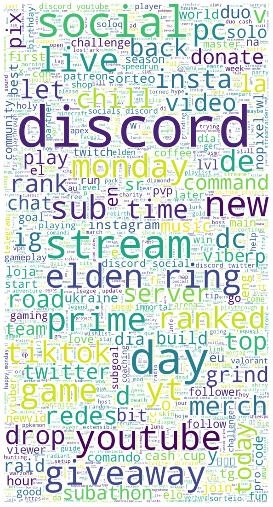

# Data Science Twitch Viewer Prediction : Project Overview

* Created a model that predicts viewers of a Twitch stream (MAE ~0.2 (output was normalized)).
* Scraped over 10000 streams from Twitch using Twitch API.
* Performed exploratory data analysis, getting a couple useful insights.
* Optimized Linear and Random Forest Regressors using GridsearchCV as baseline models.
* Created custom model that got the best result with tesorflow

## Code and Resources Used

**Python Version:** 3.8.12 (Anaconda)
**Packages:** pandas, numpy, tensorflow, sklearn, matplotlib, seaborn, http, json

## Api Scraping

Scraped the api of Twitch to get over 10000 records of different streams. With each stream we've got the following information:

* User id
* User name
* Game name
* Title
* Viewer count
* Language
* Is stream for mature

## EDA

After getting the data, I've cleaned it up so that it was usable for our models.
I looked at the distributions of the data and the value counts for the various categorical variables. Below are a few highlights from the graphs.

## Model Building

First, I transformed the categorical variables into dummy variables. I also split the data into train and tests sets with a test size of 20%.

I tried three different models and evaluated them using Mean Absolute Error, but the output was normalized so it cant be directly transformed into MAE on viewers:

* **Linear Regression** – Baseline for the model
* **Random Forest** – Since linear regression was really bad, I decided to try Random Forest Regression as a baseline and got MAE = ~0.3.
* **Custom Model** – This model was created using Tensorflow. It was able to predict viewers more accurately with MAE ~0.2 (around 100 - 250 viewers when denormalized). It is saved as 'model_big.h5' in the 'models' folder.
